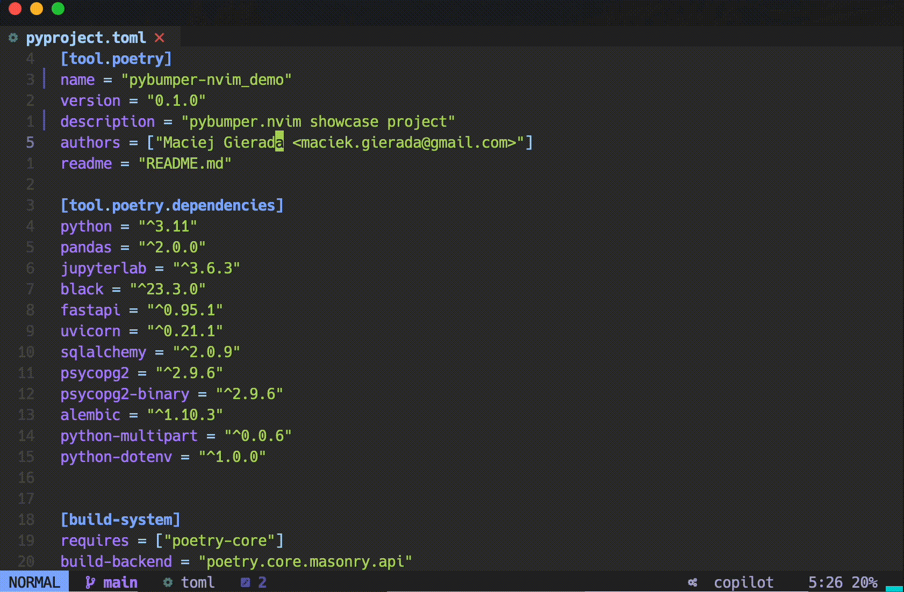
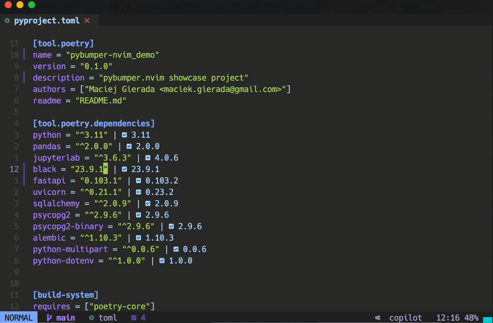
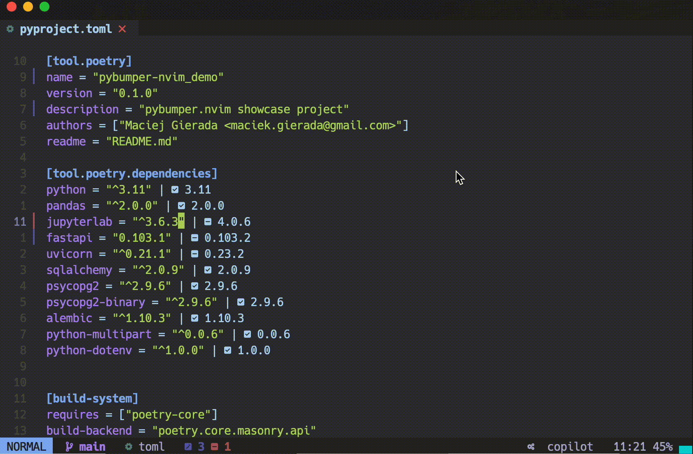

<div align="center">

# pybumper.nvim

## A wrapper around the `poetry` commands for nvim 🔌

</div>

<div align="center">


</div>

<div align="center">


</div>

## ✨ Features

- ✨ Display latest dependency versions as virtual text.
- ✨ Install any available dependency from a drop down list based on a current line.
- ✨ Add any new valid dependency.
- ✨ Upgrade dependency on a current line.
- ✨ Remove any dependency.
- 🏗 Automatic package manager detection (`poetry` supported at this moment. Support for `requirements.txt` would be added later.).
- 🏗 Loading animation hook (to be placed in status bar or anywhere else).

## 🔌 Available commands

### Display virtual_text with info about the latest versions of dependencies.

<details>
<summary>Click to expand</summary>



<details/>

### Hide or show available version on demand



### Install any valid dependency



### Delete any dependency for the current line


### Change version of any dependency from the current line


## ⚡️Requirements

It should work with any fairly modern python tech stack. I tested that for the following:

- neovim >= 0.9
- poetry >= 1.5.1
- python >= 3.10.8
- pip >= 23.2.1

## 💻 Installation

Install with your favourite package manager

[Lazy](https://github.com/folke/lazy.nvim)

```lua
  -- Pybumper
  {
    "mgierada/pybumber.nvim",
    dependencies = { "MunifTanjim/nui.nvim" },
    config = function() require("pybumper").setup {} end,
    event = "BufRead",
  },

```

## ⚙️ Configuration

The `pybumper.nvim` comes up with the following configuration. Any of of those can be easily overridden by providing a config to setup function.

```lua
{
	colors = {
		up_to_date = "#3C4048",
		outdated = "#d19a66",
	},
	icons = {
		enable = true,
		style = {
			up_to_date = "|  ",
			outdated = "|  ",
		},
	},
	autostart = true,
	package_manager = constants.PACKAGE_MANAGERS.poetry,
	hide_up_to_date = false,
	hide_unstable_versions = false,
},

```

## 💡 Inspiration

This plugin is inspired by [`package.info.nvim`](https://github.com/vuki656/package-info.nvim) which is designed to work in the JavaScript/TypeScript environment.
